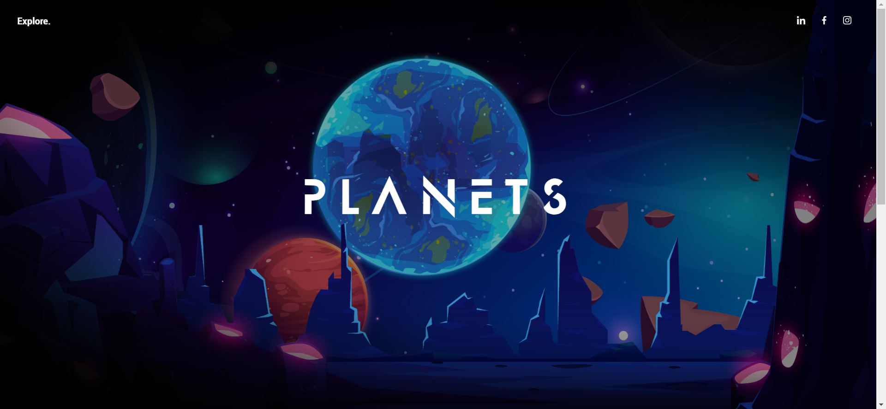
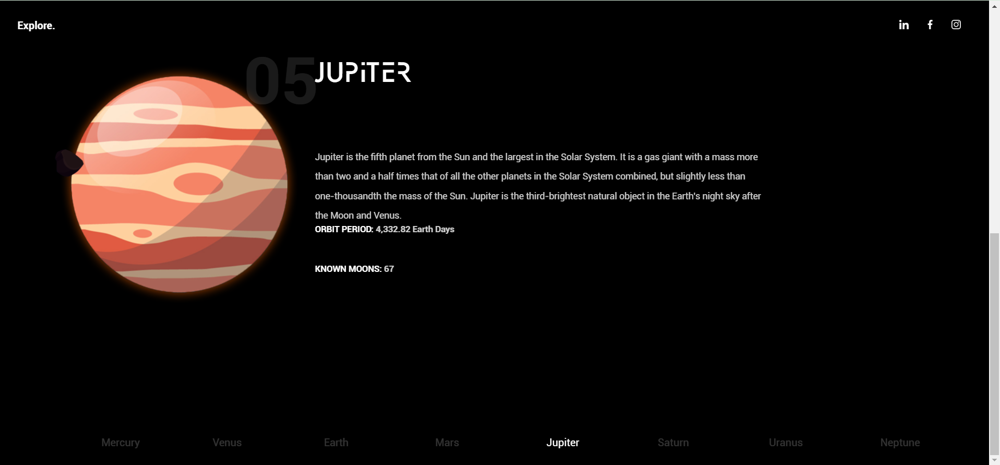
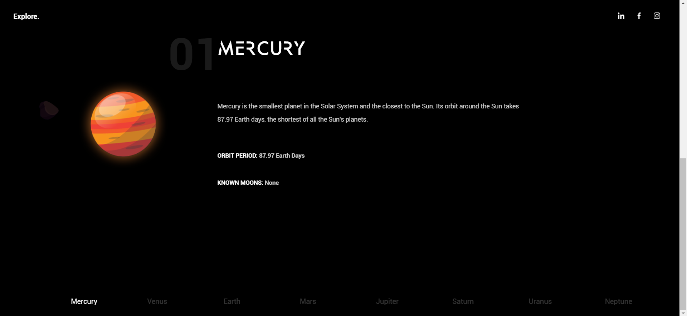

# Parallax Solar System Website 🌌

This project is a creative and interactive parallax scrolling website that takes users on a journey through our solar system. With smooth animations and layered visuals, it provides an immersive way to explore celestial bodies while demonstrating advanced web development techniques.

## Features
- **Parallax Scrolling Effect**: Creates depth and movement as users scroll through the page.
- **Solar System Visualization**: Showcases planets, moons, and the sun with detailed animations.
- **Responsive Design**: Optimized for viewing on desktops, tablets, and smartphones.
- **Educational Content**: Includes basic facts about planets and celestial objects.

## Technologies Used
- **HTML5**: Provides the structure for the solar system content.
- **CSS3**: Adds styling and animations for the parallax effect.
- **JavaScript**: Handles smooth scrolling and interactive elements.

## Screenshots

### **Home Section**


### **Jupiter Section**


### **Mercury Details**


### **Saturn Details**


## How to Run
1. Clone this repository to your local machine:
   ```bash
   git clone <https://github.com/Ajeeetsingh/Parralax-website>
